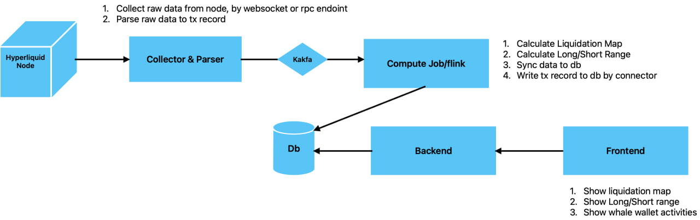
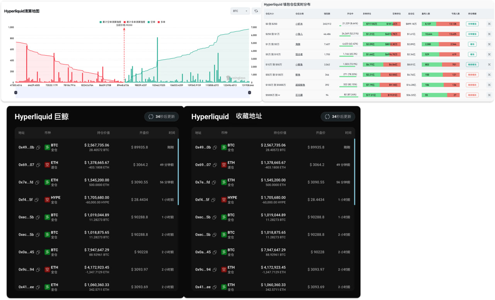

# Ave Internship Course: Hyperliquid Data Analysis 

- [Background](#background)
- [Workflow](#workflow)
- [UI/Demo](#uidemo)
- [Tasks, Schedule, and Assignment](#tasks-schedule-and-assignment)
  - [Task 1: Background & Prerequisite Knowledge](#task-1-background--prerequisite-knowledge-20251227)
  - [Task 2: System Architecture Design](#task-2-system-architecture-design-20260103)
  - [Task 3: Implementation & Validation](#task-3-implementation--validation-20260117)
  - [Task-4: Brainstorming & Challenges](#task-4-brainstorming--challenges-20260124)
  - [Task assignment](#task-assignment)
- [Links](#links)

---

## Background

This project focuses on parsing perpetual order data on Hyperliquid. It involves analyzing on-chain liquidation events and comparing Long/Short position ratios to extract deep value and actionable insights from on-chain data.

## Workflow

- Parser
    - collect data from hyperliquid node, by websocket or rpc endpoint
    - parse raw data to tx record
    - send data to kafka stream

- Computer
    - calculate liquiditaion map
    - calculate long/short range
    - persist data by connector

- Backend
    - query db and provide api
    - subscrbile kafka and push new activities to client

- Frontend
    - show ui
    - subscrbile websocket, and show the latest activities

Preparation:
- Docker env, use docker-compse for deploying
    - kafka, postgres, flink
- Data scheme
- Api definition

Advanced:
- Support watch whale walle address
- Use AI for programming
- Performance bottlenecks when dealing with massive amounts of data

## UI/Demo

## Tasks, Schedule, and Assignment

#### Task 1: Background & Prerequisite Knowledge (2025/12/27)
- Study: Contracts, Perpetuals, and On-chain Perp DEXs.   @yawen 
- Deep Dive: Hyperliquid chain logic, structure, and nodes.  @longcai
- Framework: Flink principles and hands-on usage.  @wenyu 
- DevOps: Docker configuration and deployment. @yunan

#### Task 2: System Architecture Design (2026/01/03)
- Define order schemas.
- Design database schema and structure.
- Define API specifications and WebSocket message formats.
- Setup docker-compose env

#### Task 3: Implementation & Validation (2026/01/17)
- Module development.
- System integration and comprehensive testing.

#### Task-4: Brainstorming & Challenges (2026/01/24)
- Challenge 1: Handling Scale and Traffic

    What strategies can we use to solve performance bottlenecks when facing large-scale data and a massive retail user base?

- Challenge 2: Unlocking Data Value

    How can we utilize data intelligence to discover hidden patterns and generate more valuable information?

### Task assignment

| Module | Assigner | Tasks  |
|--------|----------|--------|  
| Parser |          |        |
| Computer |        |        | 
| Backend |         |        |
| Frontend |        |        |

@Guo_oscar guo_wenyu     技术小组长

@Alyaaawen Alya Peng      yawen  -- 小组长

@octopusn920 Yunan Zhang

Long Cai 

### Links

https://hyperliquid.xyz/

https://hyperbot.network/

https://www.coinglass.com/zh/pro/futures/LiquidationMap

